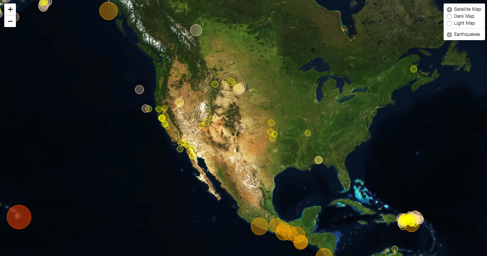

# Visualizing Earthquakes w/ Leaflet

The United States Geological Survery (USGS) maintains datasets for many geological events, including earthquakes from around the globe, and provides these to the public as a service.  Earthquake data will be used to create a geographic visualization around the globe.   

## Step 1 - Collect the Data
 - From the USGS' [GeoJSON Feed](http://earthquake.usgs.gov/earthquakes/feed/v1.0/geojson.php), we can find [API documentation](https://earthquake.usgs.gov/fdsnws/event/1/) to construct a specific query of the data we are interested in.  
 - For our purposes, we will query earthquakes from the past 7 days, which have a minimum magnitude of 2.5 on the richter scale.  

## Step 2 - Create a Visualization with Leafly
 - All earthquakes have been plotted based on their longitude and latitude coordinates transposed upon a mapbox layer,
 - Marker size and color are directly related to the magnitude, with larger values taking on a bigger shape and darker color,
 - A pop-up will appear when a marker is clicked,
 - A legend is included, as well as layer controls for various viewing options.  

## Step 3 - TO DO - Add [tectonic plates](https://github.com/fraxen/tectonicplates) to the visualization.  
